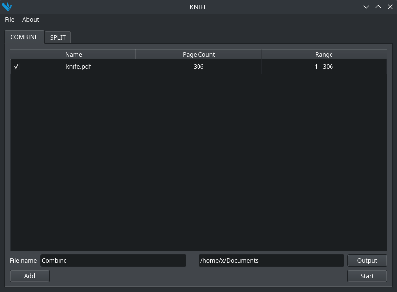

# Knife

A PDF tool that can combine or split PDF files.

English | [中文](./README_ZH.md)



## Installation

https://github.com/TaipaXu/knife/releases

## Building

### Linux & macOS

```sh
$ git clone --recursive https://github.com/TaipaXu/knife.git && cd knife
$ cd 3rd/mupdf
$ git checkout 1.19.0
$ git submodule update
$ make
$ cd ../..
$ mkdir build && cd build
$ cmake ..
$ make
```

### Windows

#### Use the master branch of MuPDF on Windows.

* [Build MuPDF with Visual Studio](https://mupdf.com/docs/building.html).
* Build this project with Qt Creator MSVC compiler.

# License

[GPL-3.0](LICENSE)
