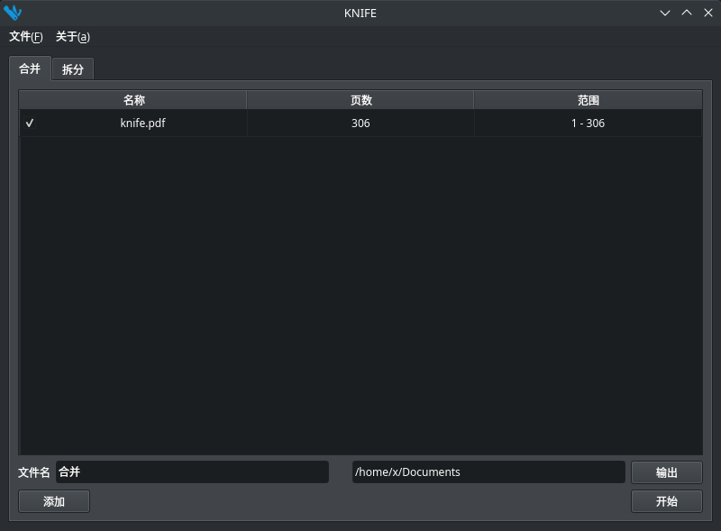

# Knife

实用的PDF工具，可以合并、裁剪PDF文件。

[English](./README.md) | 中文



## 安装

https://github.com/TaipaXu/knife/releases

## 编译

### Linux与macOS

```sh
$ git clone --recursive https://github.com/TaipaXu/knife.git && cd knife
$ cd 3rd/mupdf
$ git checkout 1.19.0
$ git submodule update
$ make
$ cd ../..
$ mkdir build && cd build
$ cmake ..
$ make
```

### Windows

#### 在Windows下使用MuPDF的master分支。

* [使用Visual Studio编译MuPDF](https://mupdf.com/docs/building.html)。
* 使用Qt Creator MSVC编译器编译此项目。

# 协议

[GPL-3.0](LICENSE)
